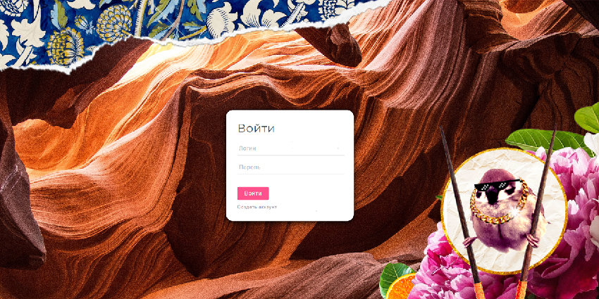

# Login form & Sign Up form

This project **uses**:  
- React  
- React Router  
- Node & Express  

## Up & Running
1. Clone this repo  
2. Install dependencies:
```
$ npm install
```  
3. Start the server:
```
$ node server.js
```    
4. Start the project in browser:
```
$ npm start
```  
5. You're wonderful! ⭐️  

## Login & Password  
🐱  Kisa + Mao   
🐶  Korgi + Gav  
or... register your own account!:)


